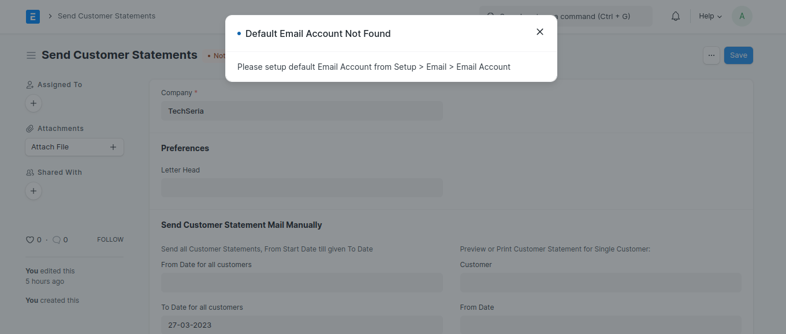
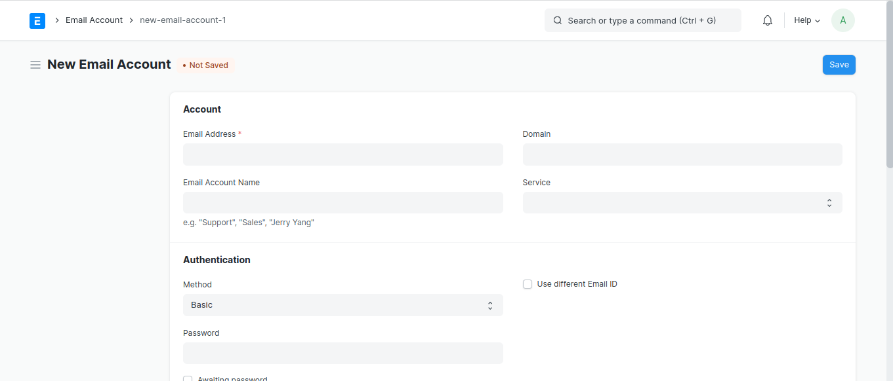
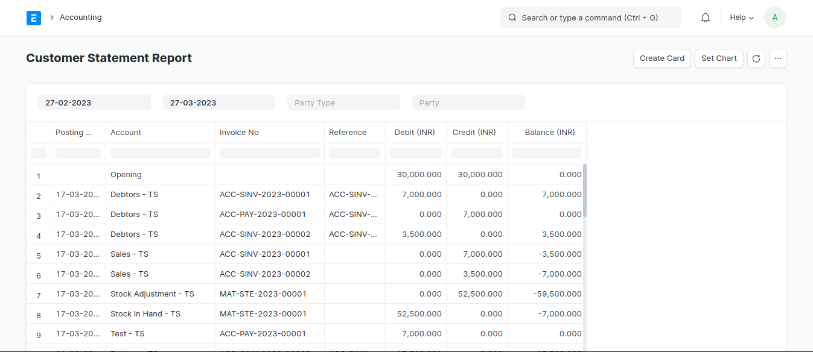
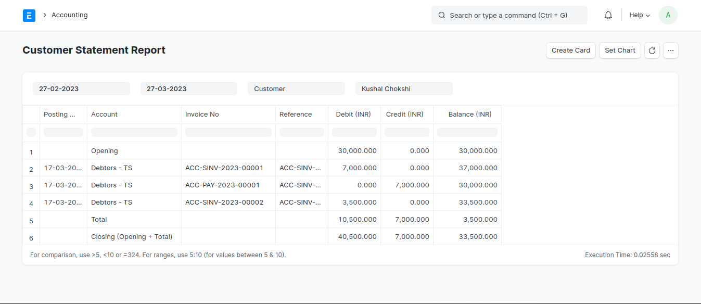
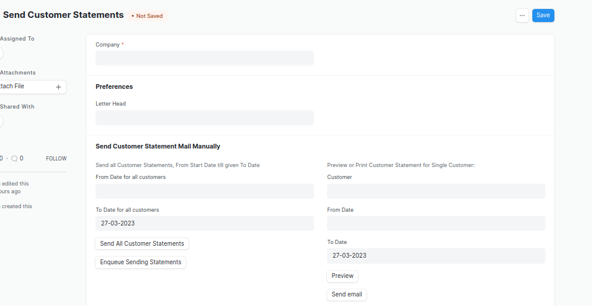
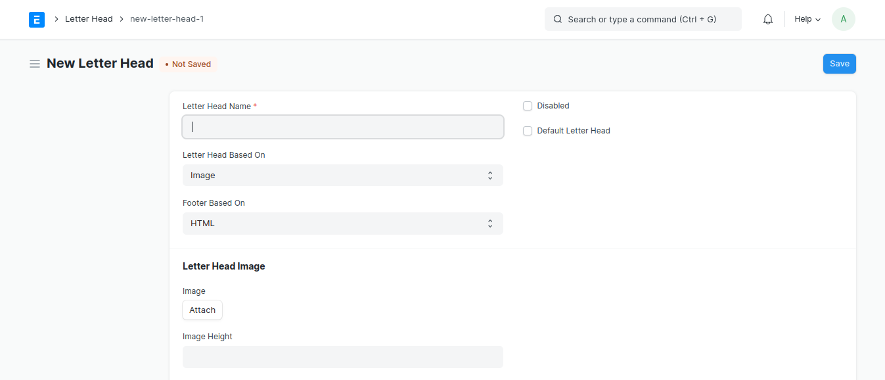
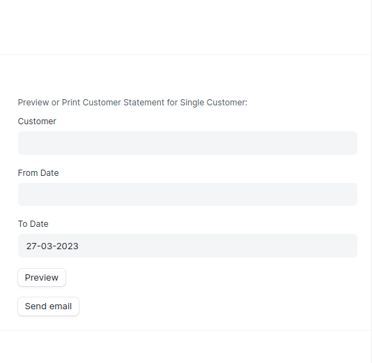
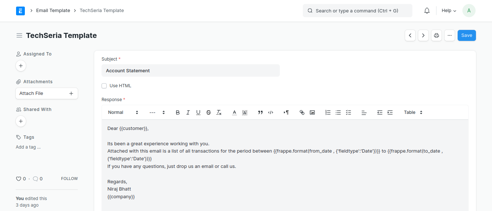

## Customer Statement

Custom Frappe Application for Sending Customer Statement (ERPNext 14 Supported)

## Installation

bench get-app https://git.techseria.com/erpnext/customer-statement.git

bench --site <<your site name>> install-app customer-statement

## Features
- Select Party and Party name in "Customer Statement Report" to generate Customer's Account Statement.
- To be able Send Customer's Statement in PDF format to individual Customer immediately.
- To be able to send Customer Statement in PDF as an email for all customer at once.
- On 5th of every month Customer will get their Account Statement in PDF format via Email.

## SMTP Email Configuration
- Firstly, SMTP Default Email Account Configuration to Send Customer Statement Email.Otherwise, it will show below error.

<kbd></kbd>

- To configure, go to searchbar and search `Email Account` and select `Email Account List` and create Email Account with `Enable Outgoing` and `Default Outgoing`.

<kbd></kbd>

## Customer Statement Report
- Go to searchbar and search `Customer Statement Report` and open it.
- Select `From Date` and `To Date` to generate Accounting Report.

<kbd></kbd>

- Select `Party Type` and `Party` to generate Customer Statement report for a selected party.

<kbd></kbd>

### Send Customer Statements
Go to searchbar and search `Send Customer Statements` and select it. It will open `Send Customer Statements` Doctype. 

<kbd></kbd>

- Select Company, it is mandatory.

## Letter Head
- Go to searchbar and search `Letter Head` and create your letter head as per your requirement and attach the logo in Image format.

<kbd></kbd>

### To Send Customer Statement Email To Customer Individually
- In `Send Customer Statements` Doctype's `Send Customer Statement Mail Manually` section, Right section is for sending Customer Statement Email to the particular Customer.

<kbd></kbd>

- Select `Customer`, `From Date` and `To Date` in which Customer's Account Statement date posted.
- To preview the Customer's Account Statement in PDF, click on `Preview` button.
- To send  Customer's Account Statement Email to selected Customer, click on `Send Email` button.

### To Send Customer Statement Email To all Customer
- In `Send Customer Statements` Doctype's `Send Customer Statement Mail Manually` section, Left section is for sending Customer Statement Email to all the Customers.

<kbd></kbd>

- Select `From Date For All Customers` and `To Date For All Customers` in which Customer's Account Statement date posted.
- To send  Customer's Account Statement Email to all Customer directly, click on `Send All Customer Statements` button.
- To send  Customer's Account Statement Email to all Customer using Queue, click on `Enqueue Sending Statements` button which will add Customers into Email Queue.

## Email Template
- `Email Template` field is mandatory field to fetch the response from `Email Template`.
- To create email template, go to searchbar and search `Email Template` and create email template according to below image.

<kbd></kbd>

- You can change the response as per your requirement.

#### License

MIT
